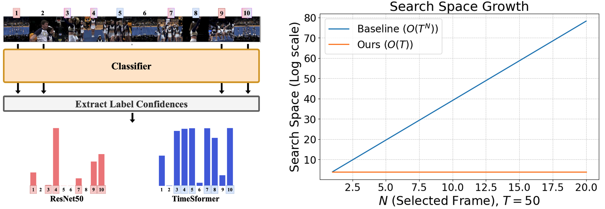
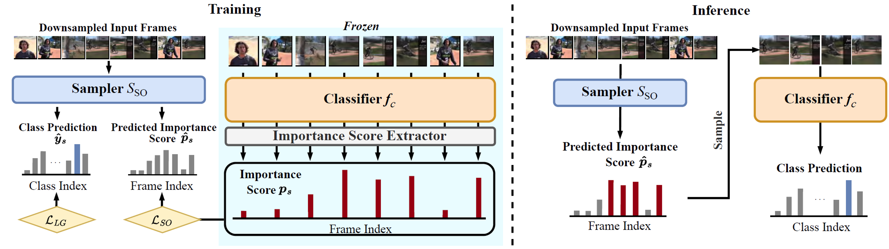

# Scalable Frame Sampling for Video Classification: A Semi-Optimal Policy Approach with Reduced Search Space
> Junho Lee, Jeongwoo Shin, Seung Woo Ko, Seongsu Ha, Joonseok Lee


https://arxiv.org/abs/2409.05260

This repository is the official Pytorch implementation for "Scalable frame sampling for video classification" paper.

## Overview
In video classification tasks, selecting the most informative frames from a large pool is crucial. However, exploring all possible combinations of frames is computationally infeasible, especially for large \( N \) (number of frames) and \( T \) (total candidates). Our approach addresses this issue by introducing a semi-optimal policy that reduces the search space, leading to efficient frame sampling without sacrificing performance.


## Proposed Solution
### Semi-Optimal Policy (\(\pi_s\))
We propose a novel **Semi-Optimal Policy (\(\pi_s\))** that independently evaluates frames, reducing the complexity from \( O(N^T) \) to \( O(T) \). This policy allows us to maintain scalability even as \( N \) and \( T \) increase.


### SOSampler
Our method, **SOSampler**, is a lightweight sampler that learns this semi-optimal policy rather than the optimal one. It effectively balances the importance of frames by scoring them independently and selecting the top \( N \) frames based on their importance scores.



## Experimental Results
Through extensive experiments, we validate the performance of SOSampler compared to other methods, highlighting its effectiveness in both small and large-scale settings.


# Installation:
a. Create a conda virtual environment and activate it.

```shell
conda create -n sosampler python=3.8 -y
conda activate sosampler
```

b. Install PyTorch and TorchVision following the [official instructions](https://pytorch.org/), e.g.,

```shell
conda install pytorch==1.7.0 torchvision==0.8.0 torchaudio==0.7.0 cudatoolkit=11.0 -c pytorch
```

Note: Make sure that your compilation CUDA version and runtime CUDA version match.
You can check the supported CUDA version for precompiled packages on the [PyTorch website](https://pytorch.org/).

c. Install Dependencies.

```shell
pip install mmcv-full==1.6.0 -f https://download.openmmlab.com/mmcv/dist/cu110/torch1.7.0/index.html
pip install einops
pip install tqdm
pip install pillow
pip install pandas
pip install tensorboard
pip install opencv-python==4.6.0
```

d. Clone the KDSampler repository.

```shell
git clone https://github.com/isno0907/sosampler
```

e. Install build requirements and then install MMAction2.

```shell
pip install -v -e .  # or "python setup.py develop"
```
## Data Preparation:
Please refer to the default MMAction2 dataset setup to set datasets correctly.

Specially, for ActivityNet dataset, we adopt the training annotation file with one label, since there are only 6 out of 10024 videos with more than one labels and these labels are similar. Owing to the different label mapping between MMAction2 and FrameExit in ActivityNet, we provide two kinds of annotation files. You can check it in data/ActivityNet/ and configs/activitynet/*.py.

For Mini-Kinetics, please download Kinetics 400 and use the train/val splits file from AR-Net

## Pretrained Models:
Todo

## Training:
```
# bash tools/dist_train.sh {CONFIG_FILE} {GPUS} {--validate}
bash tools/dist_train.sh configs/activitynet/activitynet_so_resnet50_config.py 8 --validate
```
## Inference:

```
# bash tools/dist_test.sh {CONFIG_FILE} {CHECKPOINT} {GPUS} {--eval mean_average_precision / top_k_accuracy}
bash tools/dist_test.sh configs/activitynet/activitynet_so_resnet50_config.py modelzoo/sosampler_anet_10to6_resnet50.pth 8 --eval mean_average_precision
```

## Citation
```

@article{lee2024scalable,
  title={Scalable Frame Sampling for Video Classification: A Semi-Optimal Policy Approach with Reduced Search Space},
  author={Lee, Junho and Shin, Jeongwoo and Ko, Seung Woo and Ha, Seongsu and Lee, Joonseok},
  journal={arXiv preprint arXiv:2409.05260},
  year={2024}
}

```
